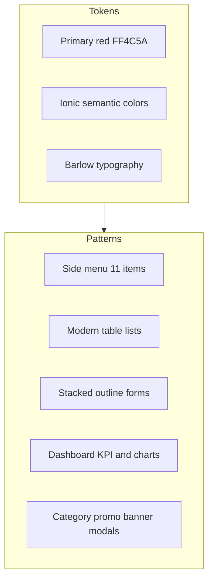
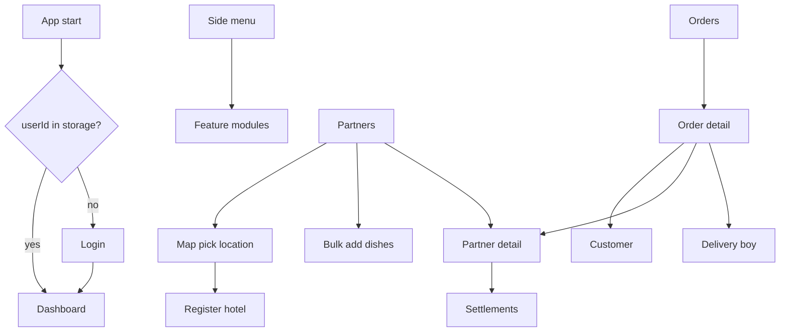

# DropEat Restaurant-Admin — CLAUDE.md

Reference document for AI assistants and designers working on the DropEat admin dashboard. Use this file to understand the design system, navigation, and every admin feature.

**UI specification (authoritative):** [design.md](design.md) — light-mode design system and per-screen specs (Section 12 implementation checklist).

**Foundation implemented:** `src/theme/variables.scss`, `src/styles/design-system.scss`, light sidebar in `app.component`, unified page shell on all screens.

### Page shell template (use on every authenticated page)

```html
<ion-header class="de-header ion-no-border">
  <ion-toolbar>
    <ion-buttons slot="start">
      <ion-menu-button class="de-menu-btn" menu="main-menu"></ion-menu-button>
    </ion-buttons>
    <ion-title class="de-header__title">Screen</ion-title>
  </ion-toolbar>
</ion-header>
<ion-content class="de-page" [fullscreen]="true">
  <div class="de-page__inner">
    <div class="de-hero"><h2>Title</h2><p>Subtitle</p></div>
    <!-- content: de-panel, de-table-card, de-feature-card, de-empty -->
  </div>
</ion-content>
```

Layout classes: `de-hero`, `de-panel`, `de-feature-card`, `de-table-card`, `de-media-grid`, `de-empty`. Reference: `banner.page.html`.

---

## Table of contents

1. [Project overview](#1-project-overview)
2. [Design system](#2-design-system)
3. [App shell and navigation](#3-app-shell-and-navigation)
4. [Complete feature list](#4-complete-feature-list)
5. [Order status reference](#5-order-status-reference)
6. [Route map and screen inventory](#6-route-map-and-screen-inventory)
7. [API and integration](#7-api-and-integration)
8. [Gaps and known issues](#8-gaps-and-known-issues)
9. [How to derive design.md](#9-how-to-derive-designmd)

---

## 1. Project overview

| Item | Value |
|------|--------|
| Product name | DropEat Admin |
| Tagline | We Drop You Eat! |
| Purpose | Operations dashboard for a food-delivery platform (restaurants, orders, drivers, customers, config) |
| Repository path | `Restaurant-Admin/` |
| Framework | Ionic 7 + Angular 17 |
| Routing base | `/folder/*` (lazy-loaded feature modules) |
| Layout | `ion-split-pane` + overlay `ion-menu` + `ion-router-outlet` (`id="main-content"`) |
| API base URL | `https://dropeat.techlapse.co.in/api/v1/` (`environment.URL`) |
| Socket URL | `https://dropeat.techlapse.co.in` (`environment.SOCKET_URL`) |
| Auth storage | `DataService` — `userId`, access/refresh tokens in Ionic Storage |
| Page components | 31 `*.page.ts` under `src/app/folder` + `banner/image-modal.component.ts` |

**Source files (entry points):**

- `src/app/app.component.ts` — menu, auth redirect
- `src/app/app.component.html` — shell branding
- `src/theme/variables.scss` — Ionic color tokens
- `src/global.scss` — global utilities, Barlow font, table styles
- `src/app/constants/order-status.constants.ts` — order status semantics

---

## 2. Design system

### 2.1 Brand identity

- **App name in menu:** DropEat
- **Subtitle in menu:** We Drop You Eat!
- **Logo asset:** `src/assets/logo.svg` — fill color `#FF4C5A`
- **Recommended primary brand color for new design work:** `#FF4C5A` (align logo and UI)

### 2.2 Color tokens

Defined in `src/theme/variables.scss` (Ionic CSS variables on `:root`).

| Token | Hex | RGB (declared) | Contrast | Use in admin |
|-------|-----|----------------|----------|----------------|
| primary | `#ff3838` | `56, 128, 255` (incorrect) | `#ffffff` | Buttons, menu selection, brand actions |
| secondary | `#3dc2ff` | `61, 194, 255` | `#ffffff` | Pickup confirmed status, secondary badges |
| tertiary | `#5260ff` | `82, 96, 255` | `#ffffff` | Delivery assigned status |
| success | `#2dd36f` | `45, 211, 111` | `#ffffff` | Delivered, accepted, positive actions |
| warning | `#ffc409` | `255, 196, 9` | `#000000` | Received, pending, customer cancel |
| danger | `#eb445a` | `235, 68, 90` | `#ffffff` | Cancelled, rejected, destructive actions |
| dark | `#222428` | `34, 36, 40` | `#ffffff` | Headings, strong text |
| medium | `#92949c` | `146, 148, 156` | `#ffffff` | Subtitles, muted labels |
| light | `#f4f5f8` | `244, 245, 248` | `#000000` | Table headers, backgrounds |

**Primary shade/tint (currently wrong):** shade `#3171e0`, tint `#4c8dff` — still Ionic blue defaults. For design.md, specify red-aligned values, e.g.:

- `--ion-color-primary-rgb: 255, 76, 90` (if using `#FF4C5A`)
- Shade/tint derived from primary red, not blue

**Semantic mapping (order badges):** see [Section 5](#5-order-status-reference).

**Banners page:** Uses shared layout classes from `design-system.scss` (brand hero, feature cards, media grid). No page-local palette.
- Accents: `#007bff`, `#28a745`, icon gradients (blue/green/pink)

**Global table helpers** (`global.scss`): borders `#eaeaea`, header `#f4f4f4`, text `#333`, hover `#f9f9f9`.

**Menu** (`app.component.scss`): inactive `#757575`, `#616e7e`; selected uses `rgba(var(--ion-color-primary-rgb), 0.14)` (may render blue tint until RGB is fixed).

### 2.3 Typography

| Aspect | Current implementation | Design spec recommendation |
|--------|------------------------|----------------------------|
| Custom font | Barlow (Google Fonts) imported in `global.scss` | Use Barlow as primary UI font |
| Utility classes | `.barlow-thin` through `.barlow-black` (100–900) | Apply `.barlow-regular` / `.barlow-semibold` on `ion-app` or `body` |
| Runtime default | Ionic/platform fonts (Roboto / system) | Explicitly set Barlow on app root |
| Table headers | 14px, letter-spacing 0.5px | Keep for data tables |
| Table cells | 13px | Keep for dense tables |
| Badges | 11px, padding 5px 10px | Status chips |
| Page titles | 20–24px, weight 600 | `.page-header h2` |
| Subtitles | 14px, `var(--ion-color-medium)` | Under page titles |
| Login title | 3rem, weight 700 | Login only |
| Empty state icon | 64px | List placeholders |
| Monospace | IDs, phone numbers in tables | Optional for technical fields |

### 2.4 Spacing

No formal design-token scale. Recurring values in page SCSS:

| Value | Typical use |
|-------|-------------|
| 4px | Tight padding |
| 8px | Menu item padding (MD), small gaps |
| 12px | Cell padding, inner gaps |
| 16px | Standard padding, iOS menu, section gaps |
| 20px | Menu list vertical padding |
| 24px | Section margins |
| 80px | Large offsets (sparse) |
| 8px / 16px | Flex gaps (`.action-buttons`, headers) |

Ionic utility CSS: `padding.css`, `flex-utils.css` imported globally.

### 2.5 Border radius

| Radius | Use |
|--------|-----|
| 2px | Banner accent bar |
| 4px | Menu items, small badges |
| 8px | Buttons, badges, image modal, login (0.5rem Bootstrap) |
| 12px | Cards, tables, pincode cards, filter segments |
| 16px | Table cards, banner tags |
| 20px | Banner pill badges |
| 50% | Circular controls (banner) |

### 2.6 Elevation and shadows

- **Table card:** `box-shadow: 0 4px 20px rgba(0, 0, 0, 0.08)`; `border-radius: 16px`
- **Cards:** Ionic `ion-card` default + animate.css entrance animations on dashboard

### 2.7 Layout patterns

#### Page header (list screens)

- Class: `.page-header`
- Structure: `h2` title + optional subtitle with `--ion-color-medium`
- Used on: Orders, Partners, and similar list pages

#### Data table (primary list pattern)

```
.table-container
  └── .table-card
        └── .modern-table (table or ion-grid)
```

- Header row: `var(--ion-color-light)` background
- Row hover: light gray highlight
- Actions: `ion-badge` with `mode="ios"`, `color` by action (secondary, danger, warning, primary)
- Empty state: centered icon (64px) + message

#### Forms

- `fill="outline"`
- `labelPlacement="stacked"`
- Primary actions: `color="primary"`, `fill="solid"`
- Secondary/toolbar: `fill="clear"`

#### Toolbar

- Start: `ion-menu-button`
- Title: `ion-title`
- End: icon buttons (`notifications-circle-outline`, `chatbox-ellipses-outline` on dashboard)

#### Dashboard

- `ion-grid` + nested `ion-card` KPI tiles
- Chart.js canvases for revenue, orders, profit, platform fees, GST, admin earnings
- `ion-list` for recent activities

#### Login (outlier)

- Bootstrap 4 card layout (`login.page.scss`)
- `.form-control`, `.btn`, `border-radius: 0.5rem`
- Not aligned with Ionic-only design system

### 2.8 Component inventory

| Component | Path | Role |
|-----------|------|------|
| App shell / side menu | `app.component` | 11 nav items, branding |
| Image modal | `folder/banner/image-modal.component.ts` | Full-screen banner preview |
| Category add | Modal from `category.page` (route `/folder/category/add` exists) | Name + image upload |
| Promo add | Modal from `promo-code.page` | Create promo |
| Promo user picker | Modal / `notification` route | Select customer for push |
| Settlement detail modal | `delivery-boy/view` | Driver settlement history |
| `appRemoveport` directive | `shared/directives/removeport.directive.ts` | Strip port from image URLs |

**No shared UI component library** under `src/app/shared` beyond the directive above.

### 2.9 Icons (Ionicons)

| Menu / area | Icon name |
|-------------|-----------|
| Dashboard | `speedometer` |
| Orders | `cart` |
| Partners | `people` |
| Customers | `person` |
| Delivery Boy | `bicycle` |
| Categories | `pricetags` |
| Chat | `chatbubbles` |
| Promo code | `pricetag` |
| Banners | `images` |
| Settings | `settings` |
| Pincode | `location` |

Order status icons: see `order-status.constants.ts` (`time-outline`, `restaurant-outline`, `bicycle-outline`, etc.).

### 2.10 Motion

- **Library:** animate.css (linked in `index.html`)
- **Dashboard:** `fadeIn`, `fadeInDown`, `fadeInUp`, `slideInLeft`, `slideInRight` with delay classes on cards
- **Content:** `animate__animated animate__fadeIn` on main content areas

### 2.11 Theme mode

- **Light only:** `<meta name="color-scheme" content="light" />` in `index.html`
- No dark theme variables or `prefers-color-scheme` overrides

### 2.12 Design system diagram



---

## 3. App shell and navigation

### 3.1 Authentication flow

1. App loads → `AppComponent.checkForLoginStatus()`
2. If `userId` in storage → navigate to `/folder/dash`
3. Else → navigate to `/folder/login`
4. Login stores tokens and `userId` → redirect to dashboard
5. Side menu hidden/disabled on login route

### 3.2 Sidebar menu (11 items)

| # | Label | Route | Icon |
|---|-------|-------|------|
| 1 | Dashboard | `/folder/dash` | speedometer |
| 2 | Analytics | `/folder/analytics` | analytics |
| 2 | Orders | `/folder/orders` | cart |
| 3 | Partners | `/folder/partners` | people |
| 4 | Customers | `/folder/customer` | person |
| 5 | Delivery Boy | `/folder/delivery-boy` | bicycle |
| 6 | Categories | `/folder/category` | pricetags |
| 7 | Chat | `/folder/chat` | chatbubbles |
| 8 | Promo code | `/folder/promo-code` | pricetag |
| 9 | Banners | `/folder/banner` | images |
| 10 | Delivery/handling Charges | `/folder/settings` | settings |
| 11 | Pincode Setup | `/folder/pincode` | location |

### 3.3 Routes not in sidebar

| Route | Purpose |
|-------|---------|
| `/folder/login` | Admin login |
| `/folder/register` | Stub |
| `/folder/reviews` | Stub |
| `/folder/notifications` | Stub (linked from dashboard toolbar) |
| `/folder/messages` | Stub (linked from dashboard toolbar) |
| `/folder/folder` | Legacy Ionic starter page |
| All `view/:id`, `add`, `map`, `hotels`, `dish`, `settle` child routes | Deep links from lists and cross-navigation |

### 3.4 Navigation flow (high level)



---

## 4. Complete feature list

Point-wise inventory for design.md feature specs. Each subsection maps to a menu area or major flow.

### 4.1 Authentication

**Login** (`/folder/login`)

- Email and password form
- Submit → API admin login
- Store access token, refresh token, `userId`
- Redirect to dashboard
- UI: Bootstrap card (outlier vs Ionic)

**Register** (`/folder/register`) — STUB

- Empty shell page
- Not in menu
- No registration logic implemented

---

### 4.2 Dashboard (`/folder/dash`)

Lightweight **operations snapshot** (default: last 30 days via `DASHBOARD_DEFAULT_PRESET`). Link: **View full analytics →** `/folder/analytics`.

- Shared KPI builder (`AnalyticsMetricsService.buildKpis` with `dashboardOnly`) — same values as Analytics on matching preset
- Period badge + quick presets (Today / 7d / 30d)
- 4 KPI cards: orders, delivered, revenue, users online
- 2 charts: revenue trend (line), orders trend (bar) — from `GET admin/analytics/summary`
- Recent orders list filtered to selected period (links to order detail)

Metrics definitions: [`docs/ADMIN_ANALYTICS_METRICS.md`](../docs/ADMIN_ANALYTICS_METRICS.md)

### 4.2b Analytics (`/folder/analytics`)

**Advanced analytics hub** — `AnalyticsService`, `AnalyticsMetricsService`, `ChartThemeService`, unified date presets (Today / 7d / 30d / MTD / YTD / custom), granularity, CSV export, period-over-period KPI deltas.

Primary data: `GET admin/analytics/summary` (KPIs, charts, status breakdown, reconciliation). Widget endpoints load with matching `startDate`/`endDate`.

Charts: revenue & orders trends, order status & cancellations, platform fees / GST / profit stack, top partners & dishes, customer activity, ratings, settlements, geo cluster table (all-time), recent orders.

Dev/staging: reconciliation panel when `!environment.production`.

API: summary endpoint plus existing admin + analytics routes. See metrics catalog for canonical definitions.

---

### 4.3 Orders

**Orders list** (`/folder/orders`)

- Page header: Order Management
- Search orders
- Filter by order status
- Filter by date range
- Paginated list
- Refresh list
- Export to XLSX
- Accept order (admin action when status allows)
- Reject order (admin action when status allows)
- Assign delivery driver(s) to order
- Open order detail view

**Order detail** (`/folder/orders/view/:id`)

- Display order ID in toolbar
- Customer information
- Hotel / partner information
- Delivery address
- Line items (dishes, quantities, prices)
- Order status timeline
- Price breakdown (subtotal, fees, GST, total)
- Payment mode
- Partner earnings vs admin earnings
- Navigate to customer profile
- Navigate to partner profile
- Navigate to delivery boy profile

---

### 4.4 Partners (restaurants)

**Partners list** (`/folder/partners`)

- Page header: Partner Management
- Search partners
- Status segment filter
- List partners and associated hotels
- Toggle hotel online / offline
- Delete partner
- Register new partner
- Set business location (map)
- Add dishes (bulk form)
- View dishes for hotel
- View partner detail
- Open settlements

**Register partner** (`/folder/partners/add`)

- Fields: name, email, phone number, password
- Submit → create partner account
- On success → navigate to map for location

**Partner map** (`/folder/partners/map/:id`)

- Google Map integration
- Geolocation / current position
- Pin picker for business location
- Reverse geocode address
- Continue to hotel registration with lat/lng

**Add hotel** (`/folder/partners/hotels/:lat/:lng/:id`)

- Hotel name
- Address
- Category multi-select (from global categories)
- Hotel image upload
- Coordinates from map step
- Submit → return to partners list

**Bulk add dishes** (`/folder/partners/dish/:id`)

- Multi-row dish entry form
- Per row: category, dish name, veg/non-veg, partner price, user price, spice level, stock, prep time, image upload
- Add multiple dishes in one session for a hotel

**Hotel dish list** (`/folder/partners/dish/:id/view/:id`)

- List dishes for a specific hotel
- Manage existing menu items

**Partner detail** (`/folder/partners/view/:id`)

- Partner profile and hotel summary
- Compensation table filtered by date range
- Settlement analytics
- Link to settlements screen

**Partner settlements** (`/folder/partners/settle/:id`)

- Per-line settlement records (order, dish, quantity, amounts)
- Partner amount vs admin amount
- Filter settled vs unsettled
- Bulk mark settlements as paid

---

### 4.5 Customers

**Customers list** (`/folder/customer`)

- Search customers
- Status filter
- Blocked / active segment control
- Block user action
- Unblock user action
- Open customer detail

**Customer detail** (`/folder/customer/view/:id`)

- Name, email, phone number
- Profile image
- Online status
- Account status (blocked/active)
- Created / updated timestamps

---

### 4.6 Delivery drivers

**Delivery boys list** (`/folder/delivery-boy`)

- Search drivers
- Filter drivers
- Block driver
- Open driver detail
- Navigate to register new driver

**Register delivery boy** (`/folder/delivery-boy/add`)

- First name, last name
- Father name
- Date of birth
- Blood group
- City, address
- Languages known (array)
- Phone number
- Profile photo upload

**Delivery boy detail** (`/folder/delivery-boy/view/:id`)

- Driver profile fields
- Earnings summary
- Settled vs unsettled orders
- Commission selection
- Mark settlements paid
- Settlement history with detail modal

---

### 4.7 Categories

**Categories list** (`/folder/category`)

- List all food categories (cached locally after first load)
- Search categories
- Add category (opens modal: name + image upload)
- Edit category
- Delete category

**Add category route** (`/folder/category/add`)

- Routed module exists; primary UX is modal from list page

---

### 4.8 Promo codes

**Promo codes list** (`/folder/promo-code`)

- List promo codes (code, type, discount, expiry, etc.)
- Open add promo modal
- Send promo notification (pick customer)

**Add promo** (`/folder/promo-code/add` — modal or route)

- Promo name
- Code string
- Discount type
- Discount value
- Minimum order amount
- Description
- Expiry date

**Promo notification picker** (`/folder/promo-code/notification`)

- Select target customer
- Send push notification with promo

---

### 4.9 Banners

**Banner management** (`/folder/banner`)

- Upload banners by app placement type:
  - Type 0: Home
  - Type 1: Cart
  - Type 2: Favorites
  - Type 3: Profile
- List active banners per type
- Preview image in full-screen modal (`ImageModalComponent`)
- Custom gradient styling (outlier palette)

---

### 4.10 Chat

**Admin chat** (`/folder/chat`)

- Two-panel workspace: conversation list (280px) + message thread (`design-system.scss` `.chat-*` classes)
- Search + All/Unread filters; unread count badges; relative timestamps (`dayjs`)
- Mobile (&lt;768px): master-detail (`viewMode` list | thread) with back button
- Socket.IO: `joinChatRoom`, `sendMessage`, `chatMessage`, `chatNotification` (no disconnect on page leave)
- REST via `ChatService`: `GET chat/active`, `GET chat/history/admin/:userId/:adminId?before=&limit=`, `PUT chat/read/:userId`
- Thread header: connection status, optional “View order” when `orderId` present
- Date separators in message list; load older messages when `hasMore`

---

### 4.11 Settings (delivery/handling charges)

**Platform settings** (`/folder/settings`)

- Platform fee amount
- GST percentage
- GST active toggle
- Delivery charges — 3 distance tiers:
  - Range 1: price, min km, max km
  - Range 2: price, min km, max km
  - Range 3: price, min km, max km
- Driver bonus settings:
  - Per-delivery allowance
  - Incentive for 16th delivery in period
  - Incentive for 21st delivery in period

---

### 4.12 Pincode setup

**Pincode management** (`/folder/pincode`)

- Create service-area pincode
- Edit pincode
- Delete pincode
- Fields: pincode, address, latitude, longitude
- Search / filter list
- Card-based list UI

---

### 4.13 Stubs and legacy (Phase 2 or placeholder designs)

| Screen | Route | Status |
|--------|-------|--------|
| Reviews | `/folder/reviews` | Empty shell |
| Notifications | `/folder/notifications` | Empty shell; linked from dashboard |
| Messages | `/folder/messages` | Empty shell; linked from dashboard |
| Register | `/folder/register` | Empty shell |
| Folder (legacy) | `/folder/folder` | Old Chart.js demo; not in menu |

---

## 5. Order status reference

**End-to-end order lifecycle (all apps + API, sockets, diagnostics):** [docs/ORDER_FLOW.md](../docs/ORDER_FLOW.md) at the monorepo root.

Source: `src/app/constants/order-status.constants.ts`

### 5.1 Status table

| Code | Enum | Display label | Short label | Ionic color | Icon | Final? | Admin can act |
|------|------|---------------|-------------|-------------|------|--------|---------------|
| 0 | RECEIVED | Received | New | warning | time-outline | No | Yes |
| 4 | ACCEPTED | Accepted | Accepted | success | checkmark-outline | No | Yes |
| 1 | BEING_PREPARED | Being Prepared | Prep | primary | restaurant-outline | No | Yes |
| 2 | DELIVERY_ASSIGNED | Delivery Assigned | Assigned | tertiary | bicycle-outline | No | Yes |
| 6 | PICKUP_CONFIRMED | Pickup Confirmed | Picked | secondary | bag-check-outline | No | No |
| 3 | DELIVERED | Delivered | Done | success | checkmark-circle-outline | Yes | No |
| 5 | CANCELLED_BY_HOTEL | Cancelled by Hotel | Cancelled | danger | close-circle-outline | Yes | No |
| 7 | CANCELLED_BY_CUSTOMER | Cancelled by Customer | Cancelled | warning | close-outline | Yes | No |
| 8 | REJECTED_BY_DELIVERY_BOY | Rejected by Delivery Boy | Rejected | danger | close-circle-outline | No | Yes (re-assign) |

### 5.2 Typical happy-path flow

```
Received (0) → Accepted (4) → Being Prepared (1) → Delivery Assigned (2) → Pickup Confirmed (6) → Delivered (3)
```

### 5.3 Admin-actionable statuses

- Received — assign delivery
- Accepted — assign delivery
- Being Prepared — assign delivery
- Rejected by Delivery Boy — re-assign driver

### 5.4 Badge design guidance

- Use `ion-badge` with `color` from table above
- Optional leading icon from metadata
- Short labels for table cells; full labels for detail view
- Final statuses: no further action buttons
- Cancelled rows: danger or warning by cancel source

---

## 6. Route map and screen inventory

### 6.1 Full route tree (under `/folder`)

```
/folder/login
/folder/dash
/folder/orders
/folder/orders/view/:id
/folder/partners
/folder/partners/add
/folder/partners/map/:id
/folder/partners/hotels/:lat/:lng/:id
/folder/partners/dish/:id
/folder/partners/dish/:id/view/:id
/folder/partners/view/:id
/folder/partners/settle/:id
/folder/customer
/folder/customer/view/:id
/folder/delivery-boy
/folder/delivery-boy/add
/folder/delivery-boy/view/:id
/folder/category
/folder/category/add
/folder/promo-code
/folder/promo-code/add
/folder/promo-code/notification
/folder/banner
/folder/settings
/folder/pincode
/folder/chat
/folder/reviews
/folder/register
/folder/notifications
/folder/messages
/folder/folder
```

### 6.2 Page component checklist (31 pages)

| # | Component path | Route / access |
|---|----------------|----------------|
| 1 | `folder/dash/dash.page.ts` | `/folder/dash` |
| 2 | `folder/auth/login/login.page.ts` | `/folder/login` |
| 3 | `folder/auth/orders/orders.page.ts` | `/folder/orders` |
| 4 | `folder/auth/orders/view/view.page.ts` | `/folder/orders/view/:id` |
| 5 | `folder/auth/partners/partners.page.ts` | `/folder/partners` |
| 6 | `folder/auth/partners/add/add.page.ts` | `/folder/partners/add` |
| 7 | `folder/auth/partners/map/map.page.ts` | `/folder/partners/map/:id` |
| 8 | `folder/auth/partners/hotels/hotels.page.ts` | `/folder/partners/hotels/:lat/:lng/:id` |
| 9 | `folder/auth/partners/dish/dish.page.ts` | `/folder/partners/dish/:id` |
| 10 | `folder/auth/partners/dish/view/view.page.ts` | `/folder/partners/dish/:id/view/:id` |
| 11 | `folder/auth/partners/view/view.page.ts` | `/folder/partners/view/:id` |
| 12 | `folder/auth/partners/settle/settle.page.ts` | `/folder/partners/settle/:id` |
| 13 | `folder/auth/customer/customer.page.ts` | `/folder/customer` |
| 14 | `folder/auth/customer/view/view.page.ts` | `/folder/customer/view/:id` |
| 15 | `folder/auth/delivery-boy/delivery-boy.page.ts` | `/folder/delivery-boy` |
| 16 | `folder/auth/delivery-boy/add/add.page.ts` | `/folder/delivery-boy/add` |
| 17 | `folder/auth/delivery-boy/view/view.page.ts` | `/folder/delivery-boy/view/:id` |
| 18 | `folder/category/category.page.ts` | `/folder/category` |
| 19 | `folder/category/add/add.page.ts` | `/folder/category/add` |
| 20 | `folder/auth/promo-code/promo-code.page.ts` | `/folder/promo-code` |
| 21 | `folder/auth/promo-code/add/add.page.ts` | `/folder/promo-code/add` |
| 22 | `folder/auth/promo-code/notification/notification.page.ts` | `/folder/promo-code/notification` |
| 23 | `folder/banner/banner.page.ts` | `/folder/banner` |
| 24 | `folder/auth/settings/settings.page.ts` | `/folder/settings` |
| 25 | `folder/pincode/pincode.page.ts` | `/folder/pincode` |
| 26 | `folder/auth/chat/chat.page.ts` | `/folder/chat` |
| 27 | `folder/auth/reviews/reviews.page.ts` | `/folder/reviews` (stub) |
| 28 | `folder/auth/register/register.page.ts` | `/folder/register` (stub) |
| 29 | `folder/auth/notifications/notifications.page.ts` | `/folder/notifications` (stub) |
| 30 | `folder/auth/messages/messages.page.ts` | `/folder/messages` (stub) |
| 31 | `folder/folder.page.ts` | `/folder/folder` (legacy) |

**Non-page UI:** `folder/banner/image-modal.component.ts`

---

## 7. API and integration

| Integration | Config | Usage |
|-------------|--------|--------|
| REST API | `environment.URL` | All CRUD via `auth.service.ts`, `http.service.ts`, `orders.service.ts` |
| Socket.IO | `environment.SOCKET_URL` | Chat, real-time order events (`app.module` SocketIoModule) |
| Local storage | `DataService` + Ionic Storage | Tokens, userId, category cache |
| Google Maps | API key in `environment.apiKey` | Partner map, hotel location |
| Charts | Chart.js | Dashboard analytics |
| File upload | Multipart to API | Categories, hotels, dishes, banners, driver profile |
| Export | XLSX | Orders list export |

**Image URLs:** Served from API host `/upload/{filename}`; `appRemoveport` directive normalizes URLs for display.

---

## 8. Gaps and known issues

Design and product gaps to address in design.md or implementation:

1. **Primary color inconsistency** — `#ff3838` vs logo `#FF4C5A`; primary RGB/shade/tint still blue
2. **Barlow font unused in templates** — utilities defined but not applied globally
3. **No dark mode**
4. **No formal spacing/type token file**
5. **Duplicated `.modern-table` styles** across feature SCSS files
6. **Login uses Bootstrap** while rest of app uses Ionic
7. **Banner page uses separate palette** not tied to Ionic tokens
8. **Stub screens** — reviews, notifications, messages, register
9. **Dashboard toolbar links** to stub pages
10. **Legacy `/folder/folder`** route still registered
11. **Terminology** — "Partners" means restaurant owners; "Delivery/handling Charges" is platform + delivery + driver bonus settings

---

## 9. How to derive design.md

The canonical design spec is already in [design.md](design.md). Use this CLAUDE.md for features/routes; use `design.md` for all visual work.

Use this CLAUDE.md as supplemental context and split content as follows:

### design.md section mapping

| design.md section | Source in CLAUDE.md |
|-------------------|---------------------|
| Brand & voice | Sections 2.1, 3.1 (tagline) |
| Color system | Section 2.2 + Section 5 (semantic) |
| Typography | Section 2.3 |
| Spacing & radius | Sections 2.4, 2.5 |
| Components | Sections 2.7, 2.8 |
| Layout / shell | Section 3 |
| Feature specs | Section 4 (one subsection per menu item) |
| User flows | Section 3.4 + Section 4 partner/order flows |
| Status badges | Section 5 |
| Screen inventory | Section 6 |
| Phase 2 / backlog | Section 4.13, Section 8 |

### Recommended design.md actions

1. Unify primary brand to `#FF4C5A` and document correct RGB, shade, tint
2. Set Barlow as global `font-family` on `ion-app`
3. Extract spacing scale (4, 8, 12, 16, 24) and radius scale (4, 8, 12, 16) as named tokens
4. Document `.modern-table` as a single **DataTable** component spec
5. Redesign login with Ionic components (match rest of admin)
6. Align banner page to brand tokens or document as marketing exception
7. Wireframe stub screens (notifications, messages, reviews) as Phase 2
8. Specify empty, loading, and error states for all list pages
9. Document modal patterns (category, promo, image preview, settlement detail)
10. Include order status badge component with all nine states from Section 5

### Out of scope for CLAUDE.md

- Customer app, partner app, driver app UI (separate projects)
- Backend API contract (see `Restaurant-API` documentation)
- Implementing stub screens or theme fixes (code changes)

---

*Last aligned with codebase: Restaurant-Admin Ionic/Angular app, 31 page components, API host `dropeat.techlapse.co.in`.*
